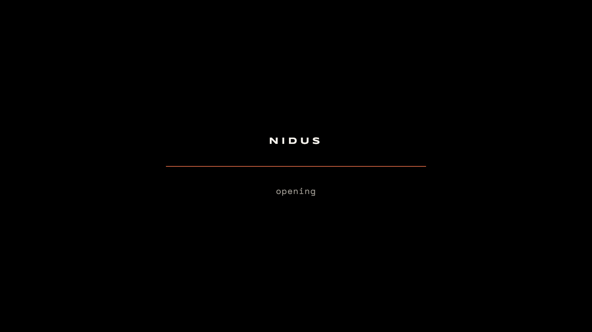
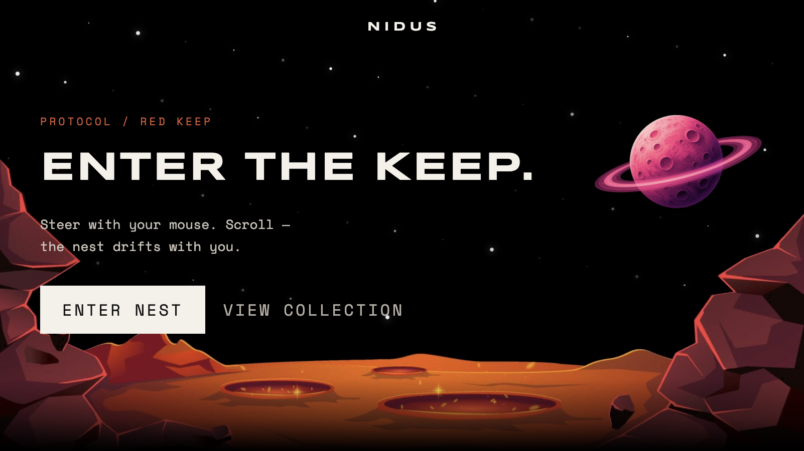
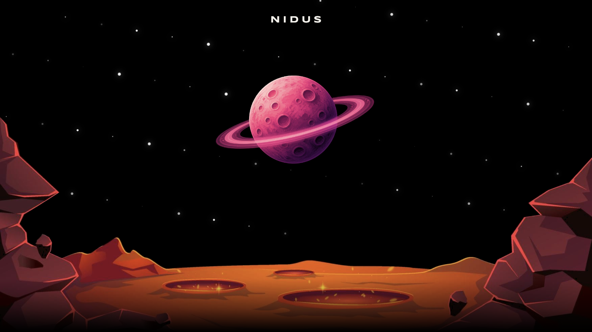
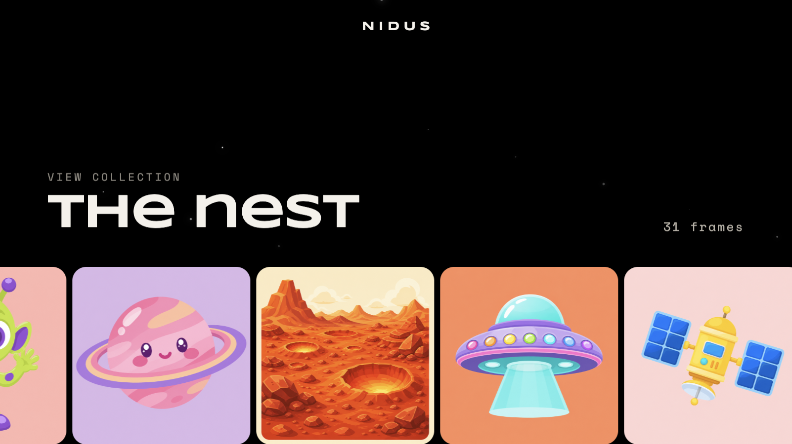
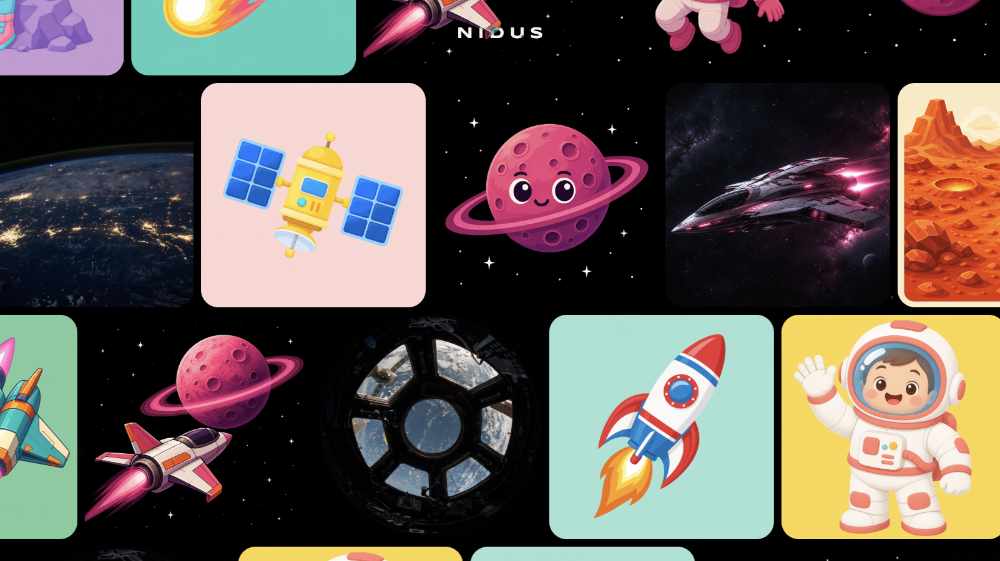
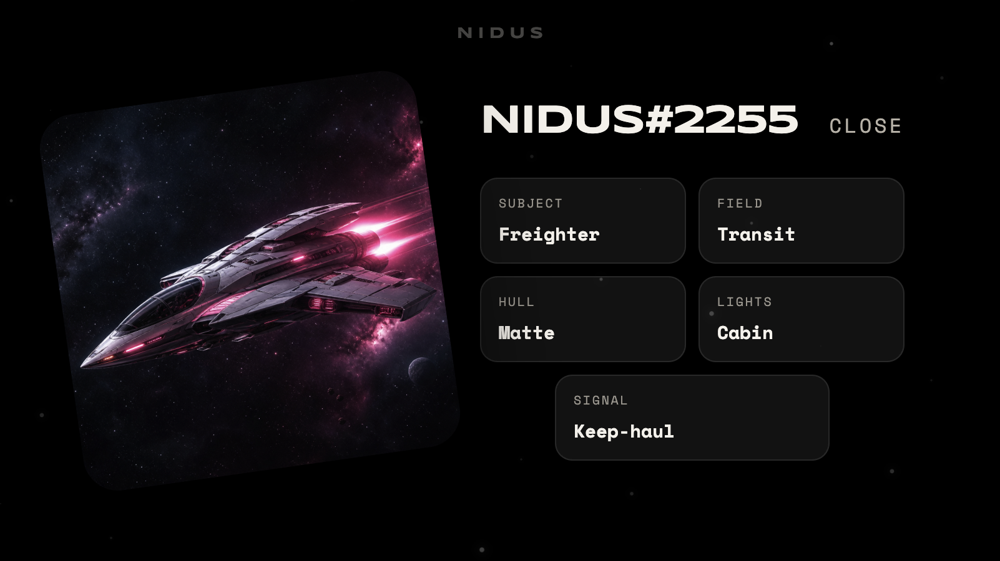
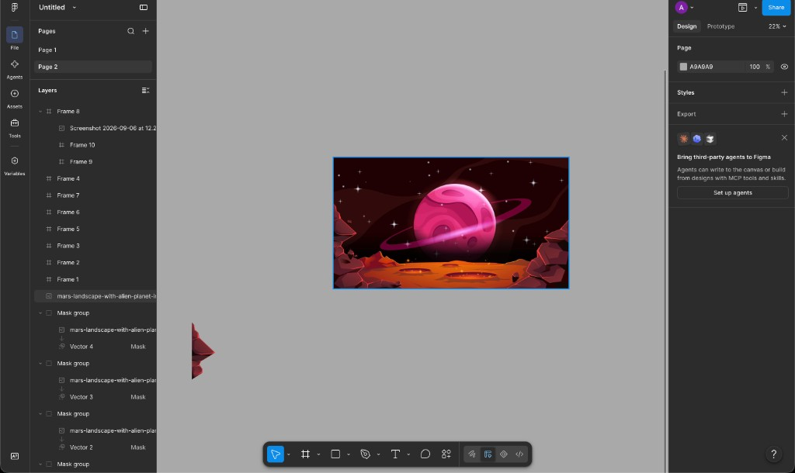
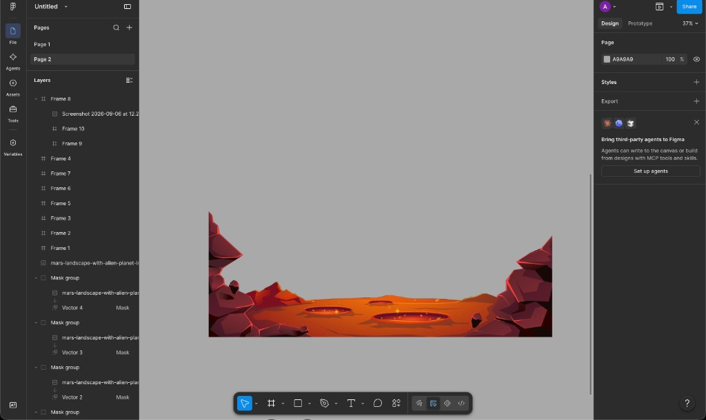

# NIDUS

**Rezerv Frontend Assessment — Part 1 (UI Animation Challenge).**

A single animated landing page built with React, TypeScript, GSAP + ScrollTrigger, Lenis, Framer Motion and Tailwind v4. Three slides: a loading gate, a pinned hero with a two-plate parallax, and an infinite-rail collection with a detail overlay.

Reference brief points at [nft.fluffyhugs.io](https://nft.fluffyhugs.io/) for the *feel* of the motion. The brief explicitly allows swapping the subject matter, so none of the branding, copy, or artwork here is taken from that site. Theme is my own: a space outpost called **NIDUS** — "the nest".

Part 2 (the data table) lives in a separate repository.

---

## Screenshots

**Loading gate — brand, progress line, status**



**Hero at rest**



**Hero mid-scroll — the planet has descended toward the ground plate while the section stays pinned**



**Collection — the section title as the rails start moving**



**Collection rails — two tracks on desktop, running in opposite directions**



**Detail overlay — click any card**



---

## Where the artwork came from

I want to be straight about this, because the brief is an animation test and I did not want anyone assuming I illustrated a full asset set in the same window.

### Hero plates — stock illustration, cut apart by me in Figma

The hero needed at least two independent layers to parallax: a planet that moves on its own, and a foreground ground plane that moves faster. I could not find that as two separate files, so I took a single flat illustration of a mars-style landscape with a ringed planet and split it myself.

This is the source illustration open in Figma:



I then built vector masks over the rock formations and the ground, and exported just that band as its own transparent PNG:



You can see the mask groups stacked in the layer panel on the left one per rock cluster, plus the ground. The planet was pulled out the same way on a separate frame.

That produced the only two files the hero actually loads:

| File | What it is |
| --- | --- |
| `public/parallax/planet.png` | Ringed planet, transparent background, cut from the source illustration |
| `public/parallax/moon-land.png` | Ground plane + side rock formations, cut from the same illustration |

So the illustration style is not mine, but the layer separation, the masking, the transparency, and everything about how those two plates move is.

### Collection frames — AI-generated

The 31 images in the collection were generated with AI image tools. I prompted for them myself rather than lifting an existing NFT collection, partly to avoid using someone else's art and partly because I needed a consistent square crop across a lot of frames to make the rails read as one set.

They are placeholders for "some collection of things", which is exactly what the brief allows. If this were real work the art direction would come from a designer.

### Everything else

Stars, shooting stars, the progress line, the detail overlay chrome, and all layout are drawn in the browser — no image assets involved.

---

## Setup

```bash
npm install
npm run dev
```

Vite prints a local URL, usually `http://localhost:5173`.

```bash
npm run build     # tsc -b && vite build
npm run preview   # serve the production build
npm run lint      # oxlint
```

No environment variables, no backend, nothing to configure. Node 20+.

One note for reviewing the loading screen: after the first visit everything is in the browser cache, so the gate hits its 3.2s floor and leaves. To see it actually working against slow assets, open DevTools → Network → throttle to Slow 3G and hard-reload. That is how the loader screenshot above was taken.

---

## Which three slides

The brief asks for any 3 of roughly 7 sections, and recommends a set that exercises every animation type. I went with the recommendation:

| # | Slide | Animation types it covers |
| --- | --- | --- |
| 1 | **Loading gate** | On-load progress, asset gating, exit transition |
| 2 | **Hero** | Pinned scroll, scrubbed parallax, mouse-move depth, text scramble on load + hover |
| 3 | **Collection** | Scroll-driven infinite rails, card hover, overlay open/close, scroll lock |

There is no fourth section. I had built a closing "Signal" CTA panel earlier and cut it — it was extra surface with no new animation technique in it, and it made the page feel padded. Removing it also removed its stars, beacon, and motion hook, which is why the shared star helpers in `src/shared/lib/stars.ts` are now smaller than they once were.

No routing. Buttons have hover and focus states and do not navigate, per the brief.

---

## Tech stack

Exact versions from `package.json`:

| Package | Version | Role |
| --- | --- | --- |
| `react` / `react-dom` | 19.2.8 | UI |
| `typescript` | 6.0.2 | Types |
| `vite` | 8.2.2 | Dev server + bundler |
| `gsap` | 3.15.0 | All scroll animation, incl. the ScrollTrigger plugin |
| `@studio-freight/lenis` | 1.0.42 | Smooth scrolling |
| `framer-motion` | 13.2.0 | The collection detail overlay |
| `tailwindcss` + `@tailwindcss/vite` | 4.3.3 | Styling |
| `oxlint` | 1.79.0 | Linting |

No component kit. There are three components on the page, and a UI library would have been more config than code.

### Why each of the three animation libraries

| Library | Why this one |
| --- | --- |
| **GSAP + ScrollTrigger** | The hero and collection are both pinned, scrubbed timelines. `pin` + `scrub` + `invalidateOnRefresh` is the part I did not want to hand-roll |
| **Lenis** | Smooth wheel inertia. Driven from GSAP's ticker so there is one scroll loop, not two fighting each other |
| **Framer Motion** | Only the detail overlay. Its enter/exit lifecycle is nicer than GSAP's, and keeping it isolated means it never touches a pinned trigger |

The next section explains what those three actually do, since they carry most of the work in this project.

---

## The three animation libraries, explained

Short guide to what GSAP, Lenis, and Framer Motion each are, what problem they solve, and where this project uses them. If you already know them, skip to [Architecture](#architecture).

### Why three libraries and not one

They are not competing — they solve different problems, and each one is doing the job it is best at:

```text
Lenis           makes the scroll position itself smooth
  ↓ feeds
GSAP            drives animation from that scroll position
Framer Motion   drives animation from React state (open / closed)
```

Lenis produces the number. GSAP reacts to the number. Framer Motion reacts to a React state change and never touches scroll at all. That separation is the whole reason all three can coexist without stepping on each other.

---

### GSAP — the animation engine

**What it is.** GreenSock Animation Platform. A JavaScript library that changes properties on DOM elements over time. Think of it as `element.style.x = …` on a schedule, but with easing, sequencing, and the browser-specific edge cases already handled.

**The core idea.** You describe a *destination* and a *duration*, and GSAP handles every frame in between:

```ts
gsap.to('.box', { x: 200, duration: 1 })   // animate TO x: 200
gsap.from('.box', { y: 40, opacity: 0 })   // animate FROM this, to current
gsap.set('.box', { x: 0 })                 // jump instantly, no animation
```

`to`, `from`, and `set` are 90% of what you need. `set` matters more than it looks — it is what you use inside a scroll handler, because it applies instantly with no tween queued up.

**Timelines** let you sequence tweens instead of juggling delays. The third argument is the position on the timeline:

```ts
const tl = gsap.timeline()
tl.to('.copy',   { opacity: 0, duration: 0.28 }, 0.08)  // starts at 0.08
  .to('.land',   { y: -110,    duration: 0.4  }, 0)     // starts at 0
  .to('.planet', { scale: 1.9, duration: 0.38 }, 0.45)  // starts at 0.45
```

Without the position argument each tween would queue after the previous one. With it, you place things on an explicit track and overlaps become easy. `src/features/hero/scrollTimelines.ts` is one long timeline built exactly this way.

**ScrollTrigger** is the plugin that connects a timeline to the scrollbar. It has to be registered once before use:

```ts
import { gsap } from 'gsap'
import { ScrollTrigger } from 'gsap/ScrollTrigger'
gsap.registerPlugin(ScrollTrigger)
```

Then the hero's trigger, which is worth reading option by option:

```ts
ScrollTrigger.create({
  trigger: root,              // element being watched
  start: 'top top',           // begin when root's top hits viewport top
  end: '+=118%',              // run for 118% of viewport height of scrolling
  pin: true,                  // freeze the section in place while it runs
  scrub: 1,                   // tie timeline progress to scroll, 1s catch-up
  animation: tl,              // the timeline to drive
  invalidateOnRefresh: true,  // re-measure values on resize
  anticipatePin: 1,           // pre-pin slightly to avoid a 1-frame jump
})
```

The two that change everything:

- **`scrub`** turns the timeline from "plays on its own" into "you are the playhead". Scroll down and it advances, scroll up and it rewinds. `scrub: 1` adds a one-second lag so it glides rather than snapping to your wheel.
- **`pin`** sticks the section to the viewport while its scroll range plays out. GSAP inserts a spacer element of the right height so the rest of the page still flows normally. This is why the hero appears to hold still while the planet descends.

**Function values** are a GSAP feature I lean on hard. Any value can be a function, and with `invalidateOnRefresh: true` it is re-evaluated on every resize:

```ts
x: () => planetXAt(root, planet, 0.42)   // measured live, not a fixed pixel
```

That single feature is why the hero has no breakpoint-specific pixel offsets.

**`gsap.matchMedia()`** builds different animations per breakpoint and cleans up automatically when the query stops matching:

```ts
const mm = gsap.matchMedia()
mm.add('(min-width: 961px)', () => createDesktopTimeline(opts))
mm.add('(max-width: 960px)', () => createMobileTimeline(opts))
```

Resize past 960px and GSAP reverts the desktop timeline and builds the mobile one. No manual teardown.

**`gsap.context()`** is the React survival tool. It records every animation created inside it so one call undoes all of them:

```ts
const ctx = gsap.context(() => {
  setupIntro(root, reduce)
  setupHeroScroll(root, onScroll)
}, root)

return () => ctx.revert()   // useEffect cleanup — kills everything
```

Without this, every hot reload stacks another copy of the timeline on the same elements and the page slowly goes insane. Every feature in this project wraps its GSAP work in a context.

**Where to find it here:** `features/hero/scrollTimelines.ts` (timeline + pin), `features/hero/useHeroMotion.ts` (context, intro tweens, mouse parallax), `features/gallery/scrollTimelines.ts`, `features/gallery/railPainter.ts` (`gsap.set` in a scroll handler), `features/loader/useLoaderBoot.ts` (the exit fade).

**Docs:** [gsap.com/docs](https://gsap.com/docs/v3/) — the ScrollTrigger page is the one to read.

---

### Lenis — smooth scrolling

**What it is.** A small library that intercepts wheel and touch input and animates the scroll position instead of jumping to it. Native scrolling moves in discrete steps per wheel tick; Lenis eases between them so the page glides.

**The core idea.** Lenis takes over the scroll position and updates it on every animation frame:

```ts
const lenis = new Lenis({
  duration: 1.15,                                        // how long to catch up
  easing: (t) => Math.min(1, 1.001 - Math.pow(2, -10 * t)), // exponential ease-out
  smoothWheel: true,
})
```

`duration` is the inertia. Higher is floatier; too high and the page feels disconnected from your hand. 1.15 is deliberately near the low end because there is scrubbed animation attached to the scroll — if the scroll itself lags too much, the hero animation feels laggy too.

**The part that actually matters: it needs a frame loop.** Lenis does nothing until something calls `lenis.raf(time)` every frame. You can let it run its own `requestAnimationFrame`, but if GSAP is also running one you get two independent loops and the scrubbed animation shears against the scroll position.

So here Lenis is driven *by* GSAP's ticker:

```ts
lenis.on('scroll', ScrollTrigger.update)          // tell ScrollTrigger we moved
gsap.ticker.add((time) => lenis.raf(time * 1000)) // GSAP drives Lenis
gsap.ticker.lagSmoothing(0)
```

Reading it line by line:

1. Whenever Lenis changes the scroll position, `ScrollTrigger.update()` recalculates every trigger — otherwise ScrollTrigger reads native scroll, which Lenis has taken over, and the hero would not move.
2. GSAP's ticker calls `lenis.raf()`. One RAF loop for the entire page. GSAP measures time in seconds and Lenis expects milliseconds, hence `* 1000`.
3. `lagSmoothing(0)` disables GSAP's catch-up-after-a-freeze behaviour. That feature is good for standalone tweens and bad for scrubbed ones — after a backgrounded tab it makes the timeline jump.

**Gotchas this project ran into:**

- Lenis must not start until the loader is gone, or you can scroll behind the gate. It is gated on `ready`.
- It is skipped entirely under `prefers-reduced-motion` — smooth scroll is exactly what that setting is asking you to turn off.
- To lock scrolling for the overlay you have to call `lenis.stop()` *as well as* the CSS lock. CSS `overflow: hidden` does not stop Lenis, because Lenis is setting the scroll position programmatically. `shared/lib/lenisBridge.ts` holds the instance in a module so any feature can call `stopLenis()` without prop-drilling.

**Where to find it here:** `shared/hooks/useLenis.ts` (setup) and `shared/lib/lenisBridge.ts` (the module-level handle).

**Note on the package name:** this project uses `@studio-freight/lenis`, the original scope. The library has since moved to plain `lenis` under the same team (Darkroom Engineering). Same library, and worth switching to on the next update.

---

### Framer Motion — animation that follows React state

**What it is.** An animation library built for React. Instead of selecting elements and telling them to move, you use special components (`motion.div`, `motion.li`) and describe what each state *looks like*. It figures out the transitions.

**The core idea — three props.** `initial` is where it starts, `animate` is where it goes, `exit` is where it goes when it unmounts:

```tsx
<motion.div
  initial={{ opacity: 0 }}
  animate={{ opacity: 1 }}
  exit={{ opacity: 0 }}
  transition={{ duration: 0.25 }}
/>
```

**`AnimatePresence` is the reason this library is here.** Normally React removes an element from the DOM instantly, so there is nothing left to animate out. `AnimatePresence` holds the element in the DOM until its `exit` animation finishes, then removes it:

```tsx
<AnimatePresence>
  {shot && <motion.div exit={{ opacity: 0 }}>…</motion.div>}
</AnimatePresence>
```

Doing this in GSAP means manually delaying the unmount and keeping a flag in sync with the animation. Framer Motion does it as a wrapper. That is the whole reason the overlay uses a different library from everything else on the page.

**Variants** name a set of states so a parent can orchestrate its children. The detail overlay's trait chips use this to stagger in:

```ts
const traitListVariants = {
  hidden: {},
  show: { transition: { staggerChildren: 0.07, delayChildren: 0.18 } },
}

const traitItemVariants = {
  hidden: { opacity: 0, x: 72 },
  show: { opacity: 1, x: 0, transition: { duration: 0.42, ease: [0.22, 1, 0.36, 1] } },
}
```

The children never receive an index or a delay. The parent declares `staggerChildren` and every child inherits its own offset automatically — add a sixth trait and the timing still works.

**Spring transitions** are physics rather than duration. The detail card uses one:

```tsx
transition={{ type: 'spring', stiffness: 260, damping: 22 }}
```

`stiffness` is how hard it pulls toward the target, `damping` is how quickly it stops. Low damping overshoots and wobbles; high damping glides in flat. 260/22 gives one small settle, which reads as weight.

**Why only the overlay.** Framer Motion animates in response to React re-renders. That is right for something driven by state (a card is open or it is not) and wrong for something driven by scroll, where you want to write transforms every frame without touching React at all. Mixing them would mean two libraries writing to the same element's transform — the exact conflict the hero's wrapper/inner-div split exists to avoid.

**Where to find it here:** `features/gallery/SpaceDetail.tsx`, and nowhere else.

**Note on the package name:** the project uses `framer-motion` v13. The library was renamed to `motion` (docs now at [motion.dev](https://motion.dev)) and `framer-motion` is the legacy alias. Same code, and another easy swap later.

---

### If you want to learn these properly

Rough order, easiest to hardest:

1. **Framer Motion first.** It fits how React already thinks. `initial` / `animate` / `exit` on a `motion.div` and you have working animation in five minutes.
2. **GSAP core next.** `gsap.to()` and `gsap.timeline()`. Ignore ScrollTrigger until sequencing feels natural, because debugging a timeline and a scroll trigger at the same time is twice the problem.
3. **ScrollTrigger after that.** Start with a plain reveal (`start`/`end`, no pin), then add `scrub`, then add `pin` last. Pinning is the one that produces confusing layout, and it is much easier to reason about once the first two are familiar.
4. **Lenis last.** It is a small API — roughly `new Lenis()`, `raf()`, `stop()`, `start()`. The difficulty is never the API, it is making it share a frame loop with whatever else is animating.

The genuinely useful debugging tool is `markers: true` on any ScrollTrigger. It draws the start and end positions right on the page, and most "why is this firing at the wrong time" questions answer themselves the moment you can see them.

---

## Architecture

Feature-sliced, with a shared kernel. Path alias `@/*` → `src/*`.

```text
src/
  main.tsx                    React root
  app/
    App.tsx                   composes loader + sections
    hooks/useAppBoot.ts       reveal / ready state, body scroll lock
    layout/                   Nav, SiteShell
  features/
    loader/
      Loader.tsx              markup
      useLoaderBoot.ts        preload + progress + exit
      constants.ts            asset list, timings, status beats
    hero/
      Hero.tsx
      useHeroMotion.ts        intro, mouse parallax, wiring
      scrollTimelines.ts      the pinned desktop / mobile timelines
      planetGeometry.ts       runtime measurement helpers
      shootingStars.ts        thin wrapper over the shared pool
      constants.ts
    gallery/
      Gallery.tsx
      useGalleryMotion.ts     scroll setup + detail scroll lock
      scrollTimelines.ts      pin + reveal triggers
      railPainter.ts          the infinite wrap math
      SpaceDetail.tsx         overlay (portaled)
      TraitChip.tsx
      constants.ts            rail config, stagger, repeat helper
  shared/
    ui/                       StarField, Button
    lib/                      stars, shootingStars, scrambleText,
                              preload, motion, lenisBridge
    hooks/useLenis.ts
    styles/
      index.css               Tailwind + @theme tokens + imports
      foundation/             base shell, keyframes, reduced-motion
      sections/               hero geometry, loader line
  content/space/shots.ts      31 frames + 3 reshuffled orders
public/
  parallax/                   the two hero plates
  space/                      collection frames
docs/screenshots/             images in this README
```

Rules I kept to:

- features import from `@/shared` and `@/content`, never from each other
- `app/` composes features and owns nothing visual except the nav
- anything two features would both need moves to `shared/lib` — that is how `scrambleText`, `stars`, and `shootingStars` ended up there

---

## Slide 1 — the loading gate


### What it does

The gate holds the page until every image the first two sections need has been decoded, then fades out. It is not a timed fake.

```text
Loader mounts
  → onReveal()  — site mounts underneath, hidden behind the gate
  → preloadImages(CRITICAL_ASSETS)   hero plates + all 31 collection frames
  → waitForElement('.hero')          React may not have mounted it yet
  → waitForImages(hero)              live  nodes, .decode() resolved
  → assetsReady
  → hold until MIN_GATE_MS
  → fade out → onComplete() → Lenis starts, scroll unlocks
```

Mounting the real page *underneath* the loader is the part that matters. If the site only mounts after the gate leaves, the hero images start downloading at the exact moment you can see them, and you get a flash of empty ground. Mounting early means the browser has already decoded those `` nodes by the time the gate lifts.

`preloadImage()` also calls `img.decode()` where available, because `onload` only means bytes arrived — not that the pixels are ready to paint.

### Progress and the minimum floor

Progress is the larger of two signals:

```ts
const timeRatio  = Math.min(1, elapsedMs / minMs)
const raw = assetsReady
  ? Math.min(1, Math.max(timeRatio, assetRatio))
  : Math.min(0.96, Math.max(timeRatio * 0.9, assetRatio * 0.88))
```

Two rules fall out of that. It can never reach 100% while assets are still in flight (hard cap at 0.96), and it can never finish faster than `MIN_GATE_MS` (3200ms) even on a warm cache. Without the floor, a repeat visit flashed the loader for about 90ms, which reads as a bug rather than a transition.

Under reduced motion the floor drops to 900ms and the exit is a plain fade.

### How the UI got here — three rewrites

This is the section I redid the most, so it is worth writing down.

**Version 1 — orbital HUD.** A large SVG progress ring driven by `stroke-dashoffset`, a percentage counter in a display face, mission-control text in three corners, a rotating planet behind it, and an exit where the screen split vertically and two panes peeled apart like a hatch. It looked good in isolation. The problem was that the hatch exit was doing the same "reveal the space scene" job the hero intro already does, so the two fought, and the whole thing sat on screen for four seconds saying nothing.

**Version 2 — "frequency gate".** I overcorrected. Five channel meters that each filled as their batch of images decoded, a rotating sonar sweep, a live `<canvas>` oscilloscope that spiked on every decoded frame, a scrolling manifest of filenames, film grain, and a CRT collapse on exit. Functionally it was the most honest loader of the three — you could literally watch which batch was slow. But it read as decoration for its own sake. Five meters, a radar, a waveform, and a file log to say "images are loading" is noise.

**Version 3 — what shipped.** Brand, a 1px progress line, one status word. Nothing else.

```text
        N I D U S
  ─────────────────────
        opening
```

All of the version-2 logic survived. The batching, the decode gating, the minimum floor, the mount-underneath trick — none of that changed. I deleted the three components that drew it and let one `scaleX` transform on a hairline report the same thing. The status text cycles through four beats (`warming the nest` → `loading frames` → `syncing the keep` → `opening`) via the shared glyph scramble, which is the only ornament left.

The line animates with `transform: scaleX()` on a full-width element rather than `width`, so it composites instead of triggering layout on every frame.

### Files

`Loader.tsx` is 50 lines of markup. `useLoaderBoot.ts` owns the whole sequence. `constants.ts` builds `CRITICAL_ASSETS` by reading `HERO_LAYERS` and `SPACE_SHOTS` directly, so adding a collection frame automatically adds it to the preload set — there is no second list to keep in sync.

---

## Slide 2 — the hero


### Getting the layers ready

Covered above in the artwork section: two PNGs cut in Figma from one illustration. Worth adding one implementation detail here — I exported the ground plate *wider than the viewport* on purpose (`min(130vw, 1600px)`, pulled left by half its own width). It has to translate upward by more than 100px during the scroll without ever showing an edge, so it needs slack on every side.

Their geometry lives in `shared/styles/sections/hero.css`, not in Tailwind classes, because GSAP measures these elements at runtime and I wanted the positioning rules in one readable block rather than spread across a long `className`.

### The pinned scroll story

`scrollTimelines.ts` builds a three-act timeline attached to a pinned trigger:

```ts
ScrollTrigger.create({
  trigger: root,
  start: 'top top',
  end: '+=118%',
  pin: true,
  scrub: 1,
  invalidateOnRefresh: true,
  anticipatePin: 1,
})
```

| Act | Position | What moves |
| --- | --- | --- |
| 1 — settle | 0 → 0.45 | Copy block lifts and fades. Planet slides toward 42% of stage width, drops 18vh, scales to 1.35. Ground creeps up 35% of its travel |
| 2 — descend | 0.45 → 0.83 | Planet continues to 28% width, 48vh, scale 1.9. Ground completes its travel |
| 3 — exit | 0.82 → 1.0 | Planet pushes to 78vh at scale 2.25 and fades out. Ground fades. Bottom gradient goes opaque, stars dim |

Z-index is pinned explicitly (`planet: 1`, `land: 5`) before the timeline runs, so the planet stays *behind* the ground the entire way down even though both are transforming.

### Measuring instead of guessing

The planet's horizontal targets are not fixed pixel values. `planetGeometry.ts` measures:

```ts
export function planetXAt(root, planet, ratio) {
  const prevX = Number(gsap.getProperty(planet, 'x')) || 0
  gsap.set(planet, { x: 0 })              // neutralise current transform
  const stage = root.getBoundingClientRect()
  const box = planet.getBoundingClientRect()
  const target = stage.left + stage.width * ratio
  const delta = target - (box.left + box.width / 2)
  gsap.set(planet, { x: prevX })          // put it back
  return delta
}
```

Each target is passed as a function, so with `invalidateOnRefresh: true` GSAP re-runs the measurement on every resize. The planet lands at 42% / 28% / 16% of the stage on a 27" monitor and on a laptop alike, without a single breakpoint-specific offset.

`planetNearGroundY()` does the same vertically, but measures against the *ground layer's* bounding box rather than the viewport, so on mobile the planet tucks behind the horizon rather than floating at an arbitrary height.

Both helpers reset the transform to zero, measure, then restore — measuring a transformed element gives you the transformed box, which is not what you want.

### Mouse parallax without a fight

The mouse-move handler is the classic conflict case: ScrollTrigger owns `x`/`y` on `.hero__layer`, so if the pointer handler also writes to those, they overwrite each other every frame.

The fix is structural. Every layer is a wrapper with an inner `.hero__layer-shift` div:

```tsx
<figure className="hero__layer hero__layer--planet">
  <div className="hero__layer-shift">
    
  </div>
</figure>
```

ScrollTrigger transforms the outer element. The pointer handler transforms the inner one. Two different nodes, no overwrite, and the two motions compose naturally.

Three more guards on the handler: desktop only (`matchMedia('(min-width: 961px)')`), skipped entirely under reduced motion, and skipped once the planet has faded below 0.85 opacity — there is no point tweening something you cannot see.

### Text

The title runs a glyph scramble on load and again on `pointerenter`. A `gsap.delayedCall(1.4, …)` flag blocks the hover version until the intro has finished, otherwise moving the mouse during page load restarts the animation mid-flight and looks broken.

Under reduced motion the scramble is skipped and the final text is written straight from `data-text`.

### Tuning the exit

First pass ended the pin at `+=165%`. Everything had faded out by roughly 70% of that, so the last half-screen of scrolling was pure black before the collection appeared — a visible dead zone.

I cut the pin to `+=118%` and compressed act 3 (durations from 0.32/0.30/0.28 down to 0.20/0.18/0.16, all starting later). Now the artwork holds through most of the scroll and dissolves right as the collection rises. The collection also got a `-6vh` top margin on desktop to close the seam.

### Breakpoints

`gsap.matchMedia` builds two separate timelines. Desktop (≥961px) pins for 118%. Mobile/tablet (≤960px) pins for 210% with a different planet path — it tucks toward the horizon instead of sweeping across, because there is no horizontal room to sweep. The mobile version also queues a double-`requestAnimationFrame` refresh, since mobile browsers report viewport height late while the URL bar is still settling.

---

## Slide 3 — the collection


### The data

31 frames in `content/space/shots.ts`, each with an id, src, name, and five trait pairs. Three additional exports (`SPACE_SHOTS_B/C/D`) are the same objects in three different orders — 30 entries each, referenced by index:

```ts
export const SPACE_SHOTS_B: SpaceShot[] = [
  SPACE_SHOTS[18], SPACE_SHOTS[6], SPACE_SHOTS[24], …
]
```

Reshuffling by reference rather than duplicating the data means each rail shows a different sequence with no extra memory and no risk of the copies drifting apart.

### Infinite rails

Each rail renders its list three times (`LOOPS = 3`) with keys namespaced per loop, then `railPainter.ts` wraps the translation with a modulo:

```ts
const travel = progress * loopWidth * 0.7
const x = i % 2 === 0
  ? wrapNeg(travel + phase, loopWidth)
  : wrapNeg(-(travel + phase), loopWidth)
gsap.set(rail, { x })
```

`loopWidth` is `scrollWidth / LOOPS`, measured live. Once translation passes one loop width it wraps back to zero, and because loop 2 is pixel-identical to loop 1 the jump is invisible. Odd rails get a negated value so adjacent tracks travel in opposite directions.

`STAGGER_FACTORS = [0, 0.42, 0.2, 0.58]` offsets each rail by a fraction of one card slot. Without it all four rails start with card #1 flush left and the grid reads as a table. The values are deliberately under 1 — a full-slot offset would leave a visible gap at the edge on the shorter rails.

The painter only ever calls `gsap.set()`. No tweens inside a scroll handler, so nothing queues up or overshoots when someone flicks a trackpad.

### Rails per breakpoint

Four rails are in the DOM. Two carry `gallery__rail--extra` and are `hidden` above 960px:

- **Desktop:** 2 rails, cards up to 260px, section pinned for `+=320%`
- **Tablet / mobile:** 4 rails, cards 148–180px, **no pin at all**

Dropping the pin below 960px was a deliberate call. A pinned section needs a tall spacer element, and on a phone that spacer is a lot of empty scroll distance with a section frozen in place — it feels like the page has stopped responding. The mobile version scrubs the rails against normal document scroll instead, so the section moves through the viewport the way you expect. Four shorter rails keep the same visual density that two tall rails give on desktop.

### The detail overlay


Clicking a card opens `SpaceDetail`, animated with Framer Motion. Traits slide in from the right on a stagger.

The bug worth documenting: the overlay was originally `position: absolute` inside the gallery section. Cards in the bottom rail are near the bottom of a very tall pinned section, so opening one positioned the overlay relative to *that* section — which meant it opened off-screen and you had to scroll to find it.

Fix was to portal the overlay into `document.body` and use `position: fixed`. Now it is centred in the viewport regardless of which card you clicked or where the pin happens to be.

Closing works via the close button, `Escape`, or clicking anywhere outside the image, title, or trait chips. The rails behind it dim to 28% opacity and get `pointer-events: none` so you cannot accidentally open a second card through the scrim.

### Scroll lock

Only on compact viewports (≤960px), and it takes four steps because no single one is enough:

1. `stopLenis()` — stop the smooth-scroll loop
2. `is-scroll-locked` on `<html>` and `<body>` — `overflow: hidden`, `overscroll-behavior: none`, `touch-action: none`
3. `body { position: fixed; top: -${scrollY}px }` — iOS Safari ignores `overflow: hidden` on body, so the position has to be frozen and the offset stashed in `data-scroll-lock-y`
4. `touchmove` and `wheel` listeners with `{ passive: false }` calling `preventDefault()`

Unlocking reverses all four and restores the scroll position with `window.scrollTo`. The lock also re-syncs on breakpoint change, so rotating a tablet mid-overlay does not leave the page stuck.

### Card interaction

Cards are real `<button>` elements with `aria-label="Open NIDUS#0041"`, `focus-visible` outlines, and `loading="lazy"` images. `[transform: translateZ(0)]` promotes them to their own compositor layer so the rail translation does not force a repaint of 90-odd images.

---

## Stars and shooting stars

Both sections share one starfield system.

Positions are deterministic, not random — `makeStars()` walks prime multipliers modulo 100:

```ts
left: `${(i * leftPrime + leftOffset) % 100}%`,
top:  `${(i * topPrime  + topOffset)  % topMax}%`,
```

Same field on every render, no layout shift, no re-randomising on HMR. The primes matter: I originally used numbers sharing a factor with 100 and got a visible diagonal lattice instead of a scatter. Hero uses 64 stars, collection 56, each with its own prime set.

Twinkle is a CSS keyframe (`starTwinkle`) rather than a JS tween, so 120 elements animate on the compositor with zero JS cost per frame. This one bit me: I had the star styles as Tailwind arbitrary utilities, and `opacity-25` beat the keyframe's opacity at the same specificity, so nothing twinkled. The star and shoot rules now live in `foundation/keyframes.css` as plain classes and the components just pass `starClassName="hero__star"`.

Shooting stars come from a pool of 10 pre-rendered elements per section, reused round-robin with a `data-busy` flag. They fire on scroll velocity — bigger scroll delta gets a burst of two, with a randomised cooldown so they never turn into a metronome. Each launch also punches two random twinkles brighter, which ties the two effects together.

---

## Smooth scroll

The mechanics are covered in [the Lenis explainer](#lenis--smooth-scrolling) above — one RAF loop, driven by GSAP's ticker, with `ScrollTrigger.update` on every scroll event.

The settings that were actually tuned for this page:

| Setting | Value | Reasoning |
| --- | --- | --- |
| `duration` | `1.15` | Low end of comfortable. Anything higher and the scrubbed hero timeline starts to feel like input lag rather than smoothness |
| `easing` | exponential ease-out | Fast at first, long tail. Matches the weight of the artwork |
| `smoothWheel` | `true` | Touch is left native — mobile browsers already do this well and overriding it fights the platform |

Lifecycle: starts only once `ready` is true (loader gone), skipped entirely under reduced motion, and stopped via `stopLenis()` while the detail overlay is open on compact viewports. The instance lives in `shared/lib/lenisBridge.ts` as a module-level handle so the gallery can reach it without prop-drilling through three components.

---

## Responsive

| Breakpoint | Hero | Collection |
| --- | --- | --- |
| Desktop ≥961px | Pin `+=118%`, planet sweeps across, mouse parallax on | Pin `+=320%`, 2 rails, cards ≤260px |
| Tablet ≤960px | Pin `+=210%`, planet tucks to horizon, no mouse parallax | No pin, 4 rails, cards ≤180px, scroll lock on overlay |
| Mobile ≤640px | Copy block repositions to bottom, tighter type scale | Cards ≤148px, tighter gaps |

Resize handling is debounced at 180ms and calls `lenis.resize()` then `ScrollTrigger.refresh()`. Because the hero's positions are functions and `invalidateOnRefresh` is on, a refresh re-measures rather than replaying stale pixel values — dragging a window between monitors keeps the planet where it should be.

Layout uses `svh`/`dvh` for viewport height so a mobile URL bar collapsing does not resize the hero mid-scroll.

---

## Performance

- **Only `transform` and `opacity` animate.** The one exception is the loader progress line, and that is `scaleX` on a fixed-width element rather than `width`.
- **Measure-then-restore.** `planetGeometry.ts` reads bounding boxes only during timeline setup and refresh, never per frame. The scroll handlers write, they do not read.
- **`gsap.set()` in scroll handlers**, never `gsap.to()`.
- **Element pools.** Shooting stars are 10 reused nodes per section, not created on demand.
- **Layer promotion where it earns it.** `will-change` sits on the handful of nodes that actually transform (`.hero__layer-shift`, `.gallery__rail`, `.gallery__inner`) and is cleared under reduced motion.
- **`loading="lazy"`** on collection images; the hero plates are preloaded eagerly by the gate before anything is revealed.
- **`gsap.context()`** wraps every feature's animations and is reverted on unmount, so nothing leaks between HMR cycles.
- **No pin on mobile collection** — avoids a tall pin-spacer and the scroll lag it causes on lower-powered devices.
- **CSS keyframes for the twinkle**, so ~120 animated elements cost nothing on the JS thread.

Production bundle is roughly 475 kB JS (158 kB gzipped) and 25 kB CSS (6.5 kB gzipped). GSAP and Framer Motion are most of that. There is no code splitting because there is one page.

**Honest gap:** the collection PNGs are large — several are close to 1 MB, and the two hero plates are about 1.6 MB each. They are what the loading gate is waiting on. Converting them to WebP/AVIF and serving responsive sizes would cut the gate's job by a lot, and it is the first thing I would do with more time. I left it out because the brief is scoped at 4–6 hours and asset optimisation is not what it is testing.

---

## Reduced motion

`prefers-reduced-motion: reduce` is honored throughout, and the page still works — it does not just freeze.

- Lenis is not initialised; native scroll takes over
- Hero and collection scroll timelines are not built at all; `resetHeroLayers()` and `paint(0)` place everything in its resting state
- Loader keeps its full asset gating but drops the floor to 900ms and exits with a plain fade
- Star twinkle and shooting stars are disabled; stars hold at 45% opacity
- Text scrambles are skipped; final strings render directly
- `will-change` is cleared so nothing sits promoted for no reason

---

## Assumptions

- Swapping in my own subject matter is explicitly allowed, so nothing here mirrors the reference site's branding or artwork — only the *kinds* of motion it uses.
- Three slides is the deliverable. I cut a fourth section rather than keep it for volume.
- Buttons need hover and focus states only. Nothing navigates.
- 31 frames is enough to prove the rail technique. The wrap math does not care whether it is 31 or 300.
- Cartoon and photographic frames intentionally sit side by side in the collection it reads as a mixed archive, which suits "the nest".
